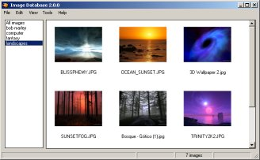



## Image Database 2\.0\.0 \(with thumbnails\)

### Description

Collects and stores all your images into a single MDB database. You can view the images found the database as thumbnails, detailed list, or simple list. You can also export the images back out fo the database. Too many features to list. Just be sure the read the readme included.

Used only basic controls in the project. No need for any outside ocxs. Just load and run. This program does however require Windows XP or GDIPlus.dll (not included of course)(Google itif you need it.)

This is still a work in progress so take that for what it is... Enjoy and I hope someone learns something from it. Or least what not to do. LOL
 
### More Info
 
Requires Windows XP or GDIPlus.dll

             |
---                |---
**Submitted On**   |2005-01-11 21:47:48
**By**             |[L\. M\. Trivette ](https://github.com/Planet-Source-Code/PSCIndex/blob/master/ByAuthor/l-m-trivette.md)
**Level**          |Advanced
**User Rating**    |4.6 (55 globes from 12 users)
**Compatibility**  |VB 6\.0
**Category**       |[Complete Applications](https://github.com/Planet-Source-Code/PSCIndex/blob/master/ByCategory/complete-applications__1-27.md)
**World**          |[Visual Basic](https://github.com/Planet-Source-Code/PSCIndex/blob/master/ByWorld/visual-basic.md)
**Archive File**   |[Image\_Data1839091112005\.zip](https://github.com/Planet-Source-Code/l-m-trivette-image-database-2-0-0-with-thumbnails__1-58239/archive/master.zip)

